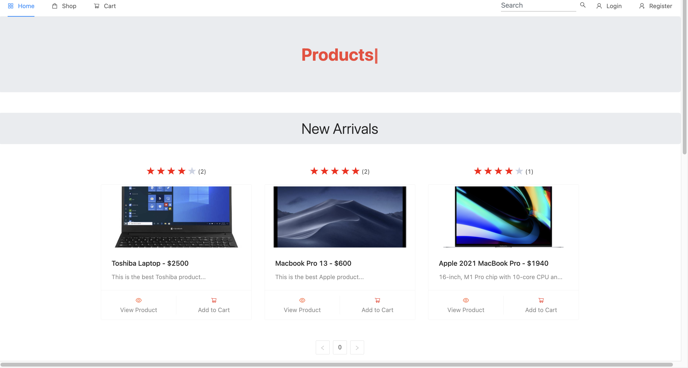
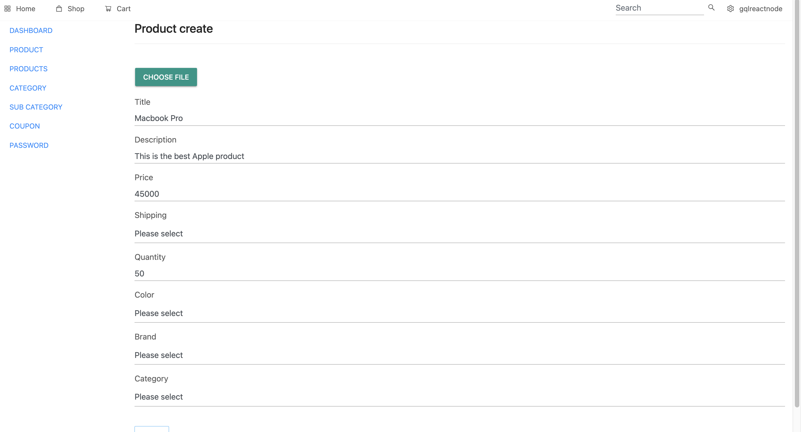
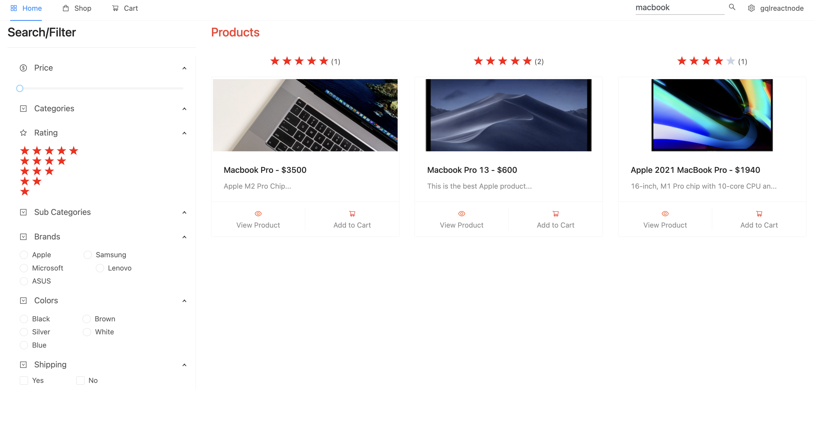
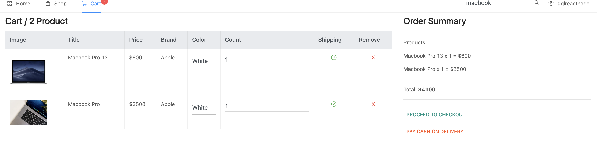

Đây là một trang web Ecommerce mà mình học môn lập trình web nâng cao viết bằng React.js, Express, Node.js và MongoDB. Ứng dụng cho phép người dùng thêm mới, sửa và xóa một sản phẩm bằng cách đăng nhập tài khoản với quyền admin. Và có thể ATC, thanh toán, xem chi tiết sản phẩm.

---

## Tech

React.js – Thư viện JavaScript để xây dựng giao diện web (UI) theo dạng component.

Express –  Framework cho Node.js, dùng để xây dựng API và backend server.

Node.js – Môi trường chạy JavaScript phía server, hỗ trợ xử lý bất đồng bộ và xây dựng backend.

MongoDB –  Cơ sở dữ liệu NoSQL dạng document, lưu trữ dữ liệu linh hoạt và dễ mở rộng.

GitHub – Triển khai 

---

### Clone & Run

```bash
git clone https://github.com/win11nt/MERN-Project.git
cd server
npm install
node node server.js
````
Open terminal ở tab mới
```bash
cd client
npm install
yarn start
````
---

## 🖼️ Demo

<div align="center">
  <h2>Giao diện</h2>
  
</div>

<div align="center">
  <h2>Thêm sản phẩm bằng quyền Admin </h2>
 
</div>

<div align="center">
  <h2>Lọc</h2>
   
</div>

<div align="center">
  <h2>Checkout</h2>
  
</div>

---